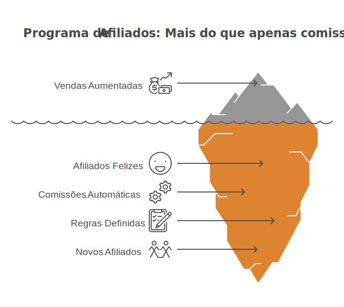

# PB Afiliados

Programa de afiliados para WooCommerce com integração PagBank Connect: links de indicação, comissões flexíveis, pagamentos manuais ou split automático, relatórios e dashboard para afiliados.

## Visão geral

O **PB Afiliados** foi criado para lojas que querem crescer com indicações sem planilhas e sem processos manuais complexos.  
Você define as regras, e o plugin:

- rastreia cliques e atribui pedidos;
- calcula comissões com regras de precedência;
- oferece área do afiliado em **Minha conta**;
- exibe materiais de apoio ao afiliado definidos por você;
- entrega relatórios administrativos e operacionais.

### Como funciona
1. Você instala e define as regras de comissão
2. Novos afiliados aderem ao programa e começam a divulgar sua loja e seus produtos em seus sites, redes sociais e através de cupons especiais, levando tráfego para seu e-commerce
3. Ao comprar em sua loja, a comissão é atribuída ao afiliado imediatamente de forma 100% automática

## Principais recursos

- Integração com **PagBank Connect** (modo de pagamento manual ou split).
- Comissão global ou específica, por categoria, por afiliado e por cupom.
- Tipos de comissão: percentual ou valor fixo.
- Link builder para afiliados gerarem URLs prontas para divulgação.
- Materiais promocionais para download na área do afiliado.
- Relatórios com cliques, pedidos e desempenho por afiliado.
- Fluxo de saque manual com registro de comprovante.
- E-mails transacionais do programa (via WooCommerce).
- Encurtador de URLs personalizadas

## Requisitos

- WordPress 6.2+
- PHP 7.4+
- WooCommerce ativo
- PagBank Connect ativo com ao menos um método de pagamento disponível
- HPOS (High-Performance Order Storage) habilitado

## Instalação
1. Baixe o [.zip do plugin](https://github.com/r-martins/pb-affiliates/archive/refs/heads/master.zip).
2. No painel WordPress, clique em **Plugins** -> ** Adicionar Plugin** e depois em ** Enviar Plugin**.
3. Envie o .zip que baixou no passo 1 e clique em **Instalar agora**.
4. Ative o plugin e configure em **Afiliados -> Configurações**

## Configuração inicial recomendada
Para obter sucesso com seu programa de afiliados:

1. Defina comissão padrão (tipo e valor).
2. Configure duração de cookie e parâmetro de tracking.
3. Escolha modo de pagamento:
   - manual (saques e marcação de pagamento manuais), ou
   - split (repasse automático via PagBank Connect).
4. (Opcional) Defina página de termos e política de cadastro de afiliados.
5. Revise regras por categoria e por afiliado, se necessário.
6. Crie materiais de apoio para seus afiliados (banners, ícones, logotipos, manual da marca, guias de divulgação) e suba eles em **Afiliados** -> **Materiais**.
7. 🏆 Faça parcerias estratégicas com influenciadores através de cupons que dêem condições e comissões especiais e diferenciadas. Você pode definir regras de comissão na edição de cupom em **Marketing** -> **Cupons**.

## Regras de comissão (resumo)

Ordem de precedência:

1. Regra de comissão definida no cupom de afiliado.
2. Regra personalizada no perfil do afiliado.
3. Cálculo por linha de item usando regra de categoria (quando existir) ou padrão da loja.

Observações:

- Em variações, a categoria considerada é a do produto pai.
- Se múltiplas categorias tiverem regra, prevalece a de menor comissão monetária para a linha.
- A comissão final é a soma das linhas.

## FAQ

### Posso usar sem PagBank Connect?

Não. O plugin depende do ecossistema PagBank Connect, especialmente no modo de pagamento via Split.
 
No caso de pagamento manual, ao menos um meio de pagamento PagBank Connect precisa estar ativo.

### Funciona com checkout legado (shortcode)?

Sim para o programa de afiliados em geral (atribuição, comissões, admin e área do afiliado).  
Recursos específicos de pagamento e disponibilidade dependem da configuração do WooCommerce/PagBank.

### O afiliado precisa instalar algo?

Não. Tudo funciona na própria loja, na conta do cliente/afiliado. No entanto, ele precisa ter uma conta PagBank para receber pagamentos via split.

## Documentação

- Central de ajuda: https://ajuda.pbintegracoes.com/hc/pt-br/sections/44721017341069-PB-Afiliados

## Licença

GPL-3.0  
https://www.gnu.org/licenses/gpl-3.0.html
